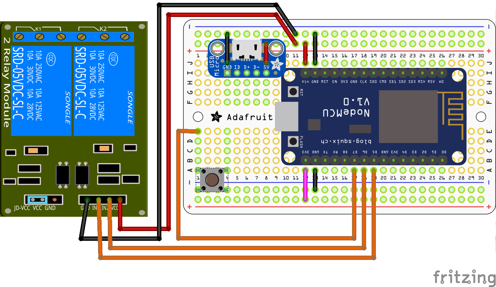
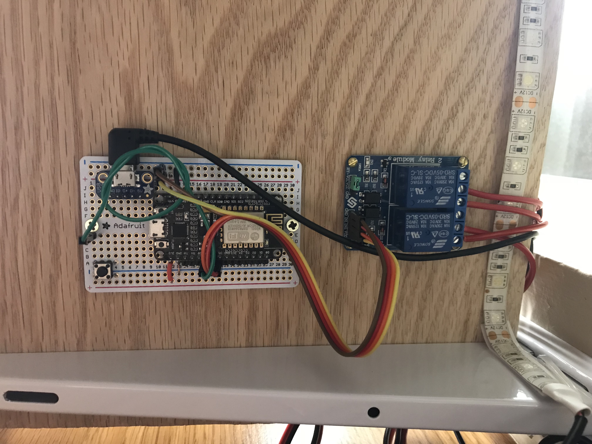
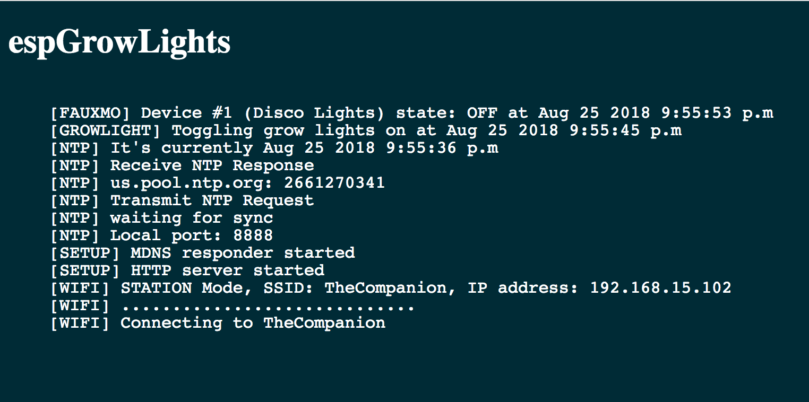

# espGrowLights

espGrowLights is an Arduino sketch for setting up a NodeMCU 1.0 (ESP-12E) to
control the grow lights for our house plants.

To use this sketch you will need to copy `config.sample.h` to
`config.h` and edit it for your wifi (these modules only support 2.4GHz).
You may also want to change the device names in `config.sample.h`.

## Usage

espGrowLights emulates two Belkin Wemo smart plugs that can be
discovered by an Echo so long as they are on the same network. The first device
is the builtin LED. The second controls both relays.

### Alexa

To turn on the grow lights simply say "Alexa, turn on the disco lights."
To trun on the on board led you can say "Alexa, turn on the esp led."

_You may have noticed that I call the grow lights disco lights... thats because
Alexa kept thinking I was saying "garage lights" when I actually said
"grow lights." The lights have a bit of a disco feel and that is not similar to
other words so it should keep her from getting cofused._

### Button

There is also a momentary push button on the edge of the board that can be used
to toggle the grow lights on or off. The code for this button includes logic to
make it only respond about every 3 seconds after its first pressed. This is so
that you don't end up rappidly turning the lights on and off multiple times. If
you want to toggle the lights more than once you can either wait a moment or
just hold the button down.

### Auto on/off schedule

A schedule has also been incorporated into this so that our lights turn
themselves on every morning and off every evening. The on and off hours are also
in `config.sample.h`. Note that the off hour uses the 24-hour format. Lastly,
note also that there are also settings for your timezone. I have included sample
entries for UTC and US Eastern (with and without daylight savings).

## Updates and troubleshooting

I've added mDNS so that you can verify the device is up by browsing to
http://espGrowLights.local or pinging `espGrowLights.local`. That name
corresponds to the `HOST_NAME` entry in `config.sample.h`. This page also acts
as a sudo console that displays log messages. This allows for basic debugging
withoug connecting to the serial port.

_Note: the page automatically refreshes every 30 seconds._

Once the initial setup is done you can push updates OTA directly from the
Arduino IDE without having to connect to it physically so long as you are on the
same network.

## Parts used

- [Ledy Led Grow Light With DC 12V 2A Adaptor](http://a.co/d/iLA3llI)
- [HiLetgo ESP8266 NodeMCU](http://a.co/hMjdhsX)
- [SunFounder 2 Channel DC 5V Relay Module](http://a.co/5G3O3XI)
- [Tactile Button switch (6mm)](https://www.adafruit.com/product/367)
- [2.1mm x 5.5 mm DC Power Pigtail Cables](http://a.co/dTNQlda)
- [Adafruit USB Micro-B Breakout Board](https://www.adafruit.com/product/1833)
- [Adafruit Perma-Proto Half-sized Breadboard PCB](https://www.adafruit.com/product/1609)
- [Spare Apple 5W USB Power Adapter](https://www.apple.com/shop/product/MD810LL/A/apple-5w-usb-power-adapter)
- [StarTech.com 3' USB Cable - A to Right Angle Micro B (UUSBHAUB3RA)](http://a.co/d/ecVLrZ4)
- [#2 x 3/8 in. Round Head Phillips Brass Wood Screw (6-Piece/Bag)](https://www.homedepot.com/p/Everbilt-2-x-3-8-in-Round-Head-Phillips-Brass-Wood-Screw-6-Piece-Bag-809901/204587524)
- [2mm Pitch 40-Pin Break-apart Male Headers](https://www.adafruit.com/product/2671)
- [Red Solid-Core Wire](https://www.adafruit.com/product/288)
- [Black Solid-Core Wire](https://www.adafruit.com/product/290)
- [Female/Female Jumper Wires](https://www.adafruit.com/product/266)
