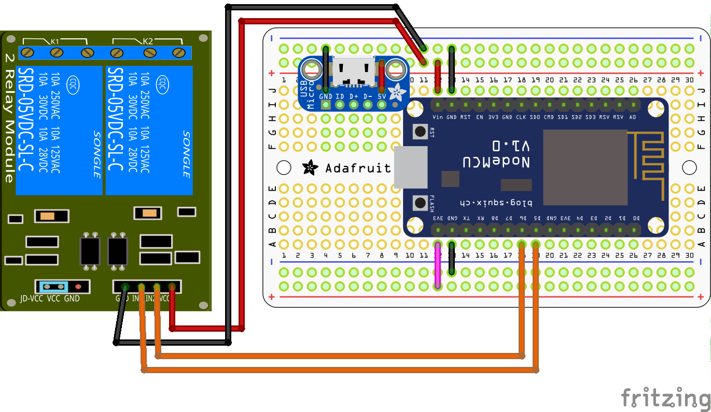
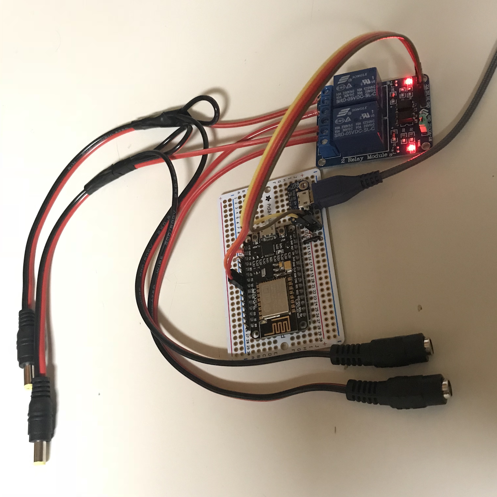

# espGrowLights

espGrowLights is an Arduino sketch for setting up a NodeMCU 1.0 (ESP-12E) to
control the grow lights for our house plants. 

To use this sketch you will need to copy `credentials.sample.h` to
`credentials.h` and edit it for your wifi (these modules only support 2.4GHz).
You may also want to change the device names in `espGrowLights.ino`.

## Usage

Currently, espGrowLights emulates two Belkin Wemo smart plugs that can be
discovered by an Echo so long as they are on the same network. The first device
is the builtin LED. The second controls both relays.

I've added mDNS so that you can verify the device is up by browsing to the
http://espGrowLights.local or pinging espGrowLights.local.

Once the initial setup is done you can push updates OTA directly from the
Arduino IDE without having to connect to it physically.

## Project Status

- v1.0.0 (the current version) is controllable via Alexa only.
- v1.5 or v2 will add a momentary switch for toggling the power state of the lights.
- v2 will add automatic on and off times so that the grwo lights cut themselves
on in the morning and off at night. My intent is to implement a NTP client so
that the times are always accurate.

## Parts used

- [HiLetgo ESP8266 NodeMCU](http://a.co/hMjdhsX)
- [SunFounder 2 Channel DC 5V Relay Module](http://a.co/5G3O3XI)
- [2.1mm x 5.5 mm DC Power Pigtail Cables](http://a.co/dTNQlda)
- [Adafruit USB Micro-B Breakout Board](https://www.adafruit.com/product/1833)
- [Adafruit Perma-Proto Half-sized Breadboard PCB](https://www.adafruit.com/product/1609)
- [Spare Apple 5W USB Power Adapter](https://www.apple.com/shop/product/MD810LL/A/apple-5w-usb-power-adapter)
- Micro USB cable from Target
